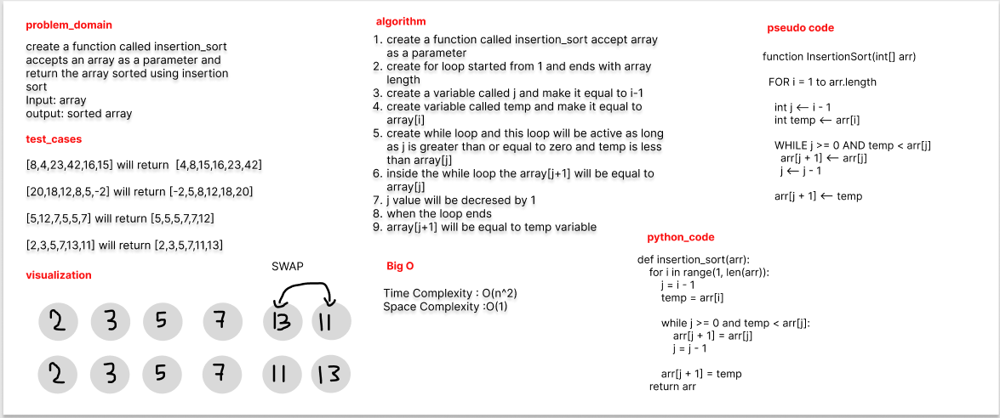

# Challenge Summary

create a function called insertion_sort accepts an array as a parameter and return the array sorted using insertion sort

## Whiteboard Process



## Approach & Efficiency
the solution is checking each element and compare this element with the previous elements

## Solution

```python
def insertion_sort(arr):
    for i in range(1, len(arr)):
        j = i - 1
        temp = arr[i]

        while j >= 0 and temp < arr[j]:
            arr[j + 1] = arr[j]
            j = j - 1

        arr[j + 1] = temp
    return arr


```