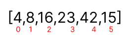

  


```
pass1:
- in the first pass,the index j will be equal to index i-1,and the value of temp will be equal to the 
element located in the index i, which is 4.

- the while loop will check if the temp is less than the previos element and the the value of j is greater than 0, if the two conditions are true,
the element located in  j+1 index will be equal to the elenment located in index j
- the value of j will be decreased by 1 
- the while loop will keep running until the one of the conditions is false
- after the validation ends, 8 and 4 will be swapped
 
```

```pass2```


```
- The value of i will be 2,which is the index for value 23, j value will be 
1, so it will have value of of 8
- the while loop  condition will be false, so nothing will change 
```

```pass 3 ```


```
- The value of i will be 3,which is the index for value 42, j value will be 
2, so it will have value of of 23
- the while loop condition will be false, so nothing will change 
```

  
  
  


```
- The value of i will be 4,which is the index for value 16, j value will be 
3, so it will have value of of 42
- 16 is less than 42 so the value of 16 will be 42
- 16 is less than 23 so the 42 will be 23
- 16 is greate than 8 so 23 will be replaced by 16 
```


  
  
  
  
  
```
- The value of i will be 5,which is the index for value 15, j value will be 
4, so it will have value of of 42
- 15 is less than 42 so the value of 42 will be 23
- 15 is less than 23 so the 42 will be 16
- 16 is less than 23 so the 23 will be 16
- 15 is greate than 8 so 16 will be replaced by 15 

```

