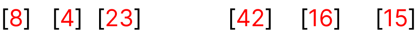

1- here we have the unsorted list   

2- we will divide the array into two parts  

3- we will keep dividing the array until we reach to one element

4- now the array divided until we have only one element

5- we will combine two elements and sort them

6- we will combine the rest elements

6- final sorted array
