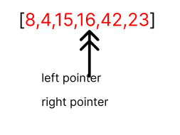

1- unsorted array

;

2- determine the pivot  

;

3- set left and right pointers  

;

4- check the pivot with left pointer, 8 is less than 15, so left pointer will be shifted one step right  

;

5- check the pivot with left pointer, 4 is less than 15, so left pointer will be shifted one step right  

  

6- check the pivot with left pointer, 23 is greater than 15, so 23 and 15 will be swapped and the right pointer will be shifter to the left

  

7- check the left pointer with the right pointer, 15 is less than 16 , so left pointer will be shifted to the right

  

8- 42 is greater than 16 so, 16 and 42 will be swapped and the right pointer will be moved

  

9- 15 is in the correct place, so we will start divide the array and repeat the steps until the array is sorted   

10- sorted array

