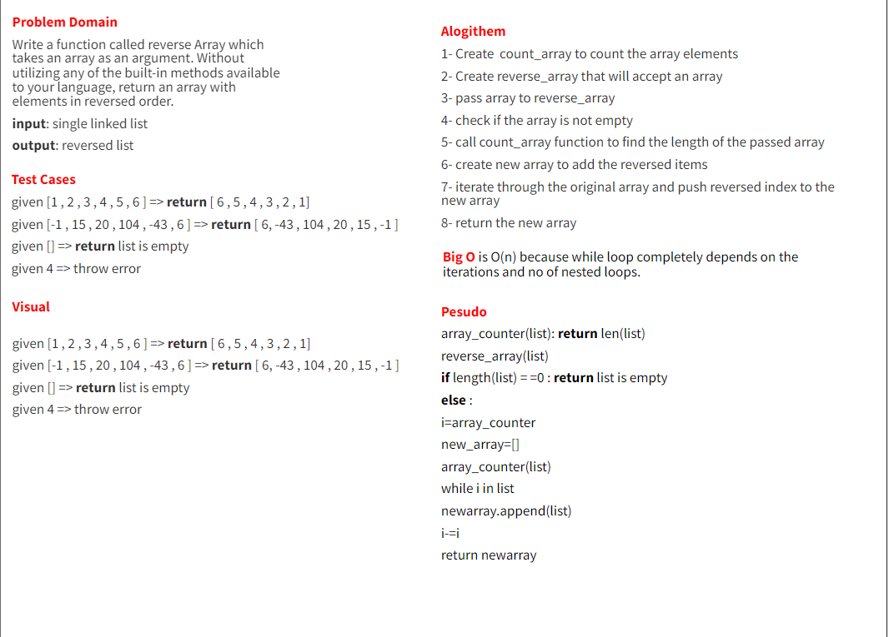

# Reverse an Array

Write a function called reverseArray which takes an array as an argument. Without utilizing any of the built-in methods
available to your language, return an array with elements in reversed order.

## Whiteboard Process

## Approach & Efficiency

according to requitemts, it's not allowed to use any built-in methods.
so we need to use a loop to reverse the array.
I used while loop to reverse the array.
Time complexity is O(n)
How many statements are executed, relative to input size n? Often,
but NOT always, we can get an idea from the number of times a loop
iterates.