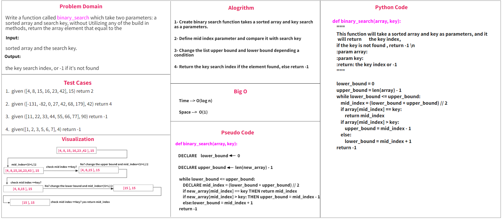

[Binray Search -Pull Request Link](https://github.com/Ahmad-Khaled-Zaid/data-structures-and-algorithms-python/pull/8)

# Binary Search of Sorted Array

Write a function called BinarySearch which takes in 2 parameters: a sorted array and the search key. Without utilizing
any of the built-in methods available to your language, return the index of the array’s element that is equal to the
value of the search key, or -1 if the element is not in the array.

## Whiteboard Process

## Approach & Efficiency

First ,I designed a function takes an array as a parameter and return new sorted array
Second,I designed a function takes an array  and search key as parameters and return index of the array’s
element that is equal to the key element or -1 if the element is not in the array.
