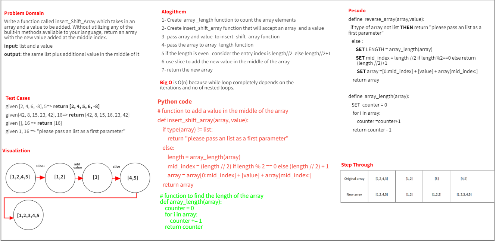

# Insert to Middle of an Array
Write a function called insertShiftArray which takes in an array and a value to be added. Without utilizing any of the built-in methods available to your language, return an array with the new value added at the middle index.

## Whiteboard Process

## Approach & Efficiency
two functions are created, first function will find the array length , the second function will insert the value in the middle of the passed array 
the best approach to do that is by using the array length and divided by two, if the reminder is equal to zero
that means the length of the function is even, otherwise it is odd, depending on this value, we are going
to know where to insert the value by using slice method
multiple test are going to pass to the function to check if the function do it's functionality as required or not
