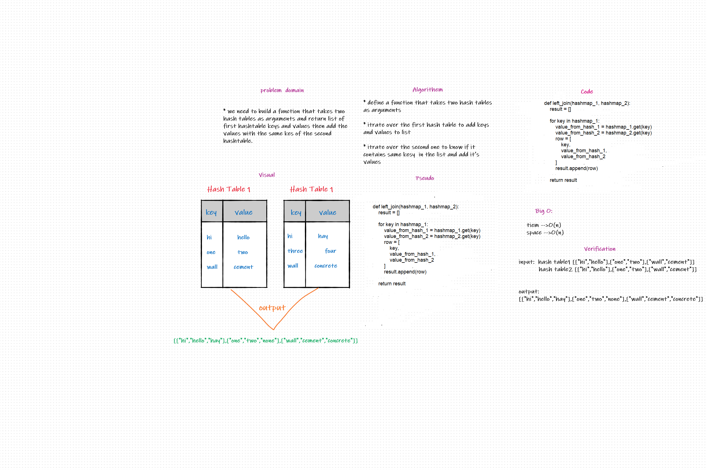

# Hashmap LEFT JOIN

Write a function called left join returned data structure that achieves the LEFT JOIN logic

## Challenge

Write a function called left join  
Arguments: two hash maps  
The first parameter is a hashmap that has word strings as keys, and a synonym of the key as values.  
The second parameter is a hashmap that has word strings as keys, and antonyms of the key as values.  
Return: The returned data structure that achieves the LEFT JOIN logic.

## Whiteboard Process


## Approach & Efficiency

Utilize the Single-responsibility principle: any methods you write should be clean, reusable,
abstract component parts to the whole challenge. You will be given feedback and marked down
if you attempt to define a large, complex algorithm in one function definition.

## Solution

```python
def left_join(hashmap_1, hashmap_2):
    result = []

    for key in hashmap_1:
        value_from_hash_1 = hashmap_1.get(key)
        value_from_hash_2 = hashmap_2.get(key)
        row = [
            key,
            value_from_hash_1,
            value_from_hash_2
        ]
        result.append(row)

    return result

```
