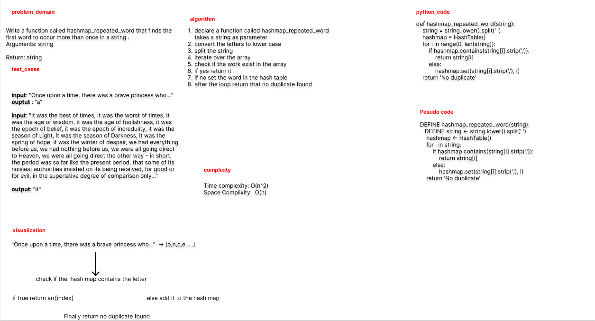

# Challenge Summary

Write a function called repeated word that finds the first word to occur more than once in a string
Arguments: string  
Return: string  

## Whiteboard Process


## Approach & Efficiency

use HashMap

## Solution

```python

def hashmap_repeated_word(string):
    string = string.lower().split(' ')
    hashmap = HashTable()
    for i in range(0, len(string)):
        if hashmap.contains(string[i].strip(',')):
            return string[i]
        else:
            hashmap.set(string[i].strip(','), i)
    return 'No duplicate founded'


```