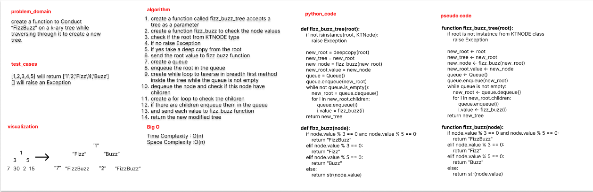

## Challenge Summary

create a function to Conduct “FizzBuzz” on a k-ary tree while traversing through it to create a new tree.

## Whiteboard Process



## Approach & Efficiency

use breadth first method to traverse through the tree and check the if the value's reminder on 3 or 5 or 3 and 5 is
equal to zero

## Solution

```python

def fizz_buzz_tree(root):
    if not isinstance(root, KTNode):
        raise Exception

    new_root = deepcopy(root)
    new_tree = new_root
    new_node = fizz_buzz(new_root)
    new_root.value = new_node
    queue = Queue()
    queue.enqueue(new_root)
    while not queue.is_empty():
        new_root = queue.dequeue()
        for i in new_root.children:
            queue.enqueue(i)
            i.value = fizz_buzz(i)
    return new_tree


def fizz_buzz(node):
    if node.value % 3 == 0 and node.value % 5 == 0:
        return "FizzBuzz"
    elif node.value % 3 == 0:
        return "Fizz"
    elif node.value % 5 == 0:
        return "Buzz"
    else:
        return str(node.value)


```
