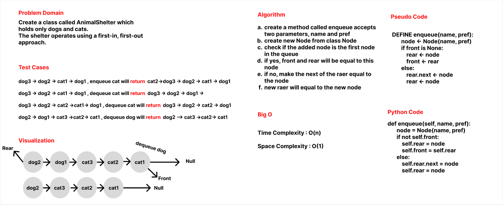

# Challenge Summary
Create a class called AnimalShelter which holds only dogs and cats.
The shelter operates using a first-in, first-out approach.

## Whiteboard Process

## Approach & Efficiency
Normal queue data structure is used to solve this challenge.

## Solution

