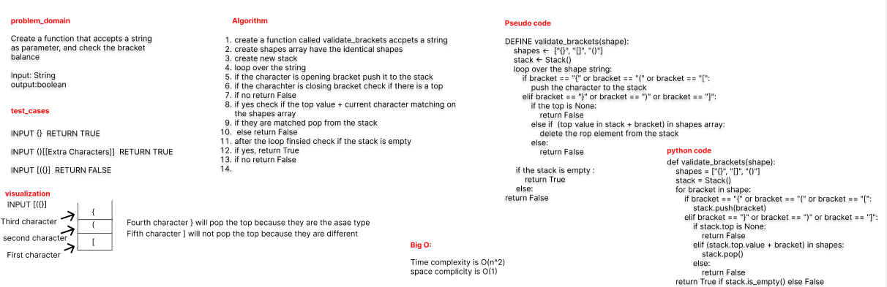
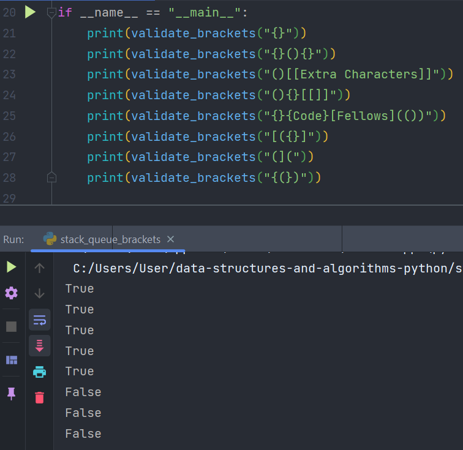

# Challenge Summary

Write a function called validate brackets
Arguments: string
Return: boolean
representing whether the brackets in the string are balanced

## Whiteboard Process

## Approach & Efficiency

Create a stack and push the opening brackets onto it, and each Time reaching to a close bracket
check if the last bracket pushed is the same as the close bracket.

## Solution

