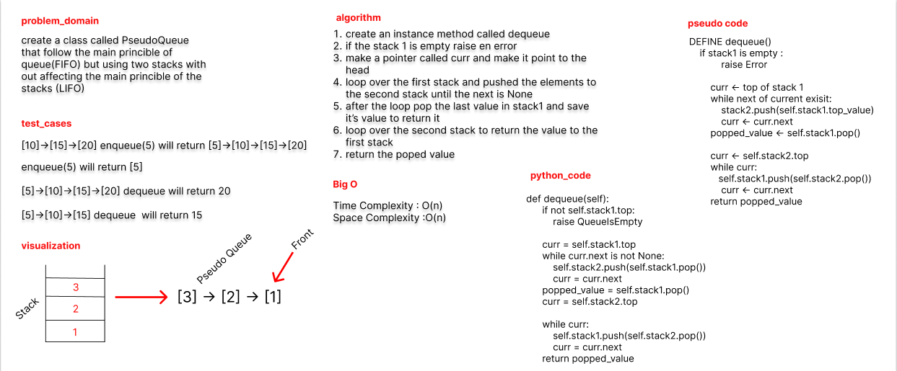

# Challenge Summary
Create a new class called pseudo queue.  
Do not use an existing Queue.  
Instead, this PseudoQueue class will implement our standard queue interface (the two methods listed below),  
Internally, utilize 2 Stack instances to create and manage the queue  

## Whiteboard Process

## Approach & Efficiency
Methods:  
enqueue  
Arguments: value  
Inserts value into the PseudoQueue, using a first-in, first-out approach.  
dequeue  
Arguments: none  
Extracts a value from the PseudoQueue, using a first-in, first-out approach.  

## Solution

