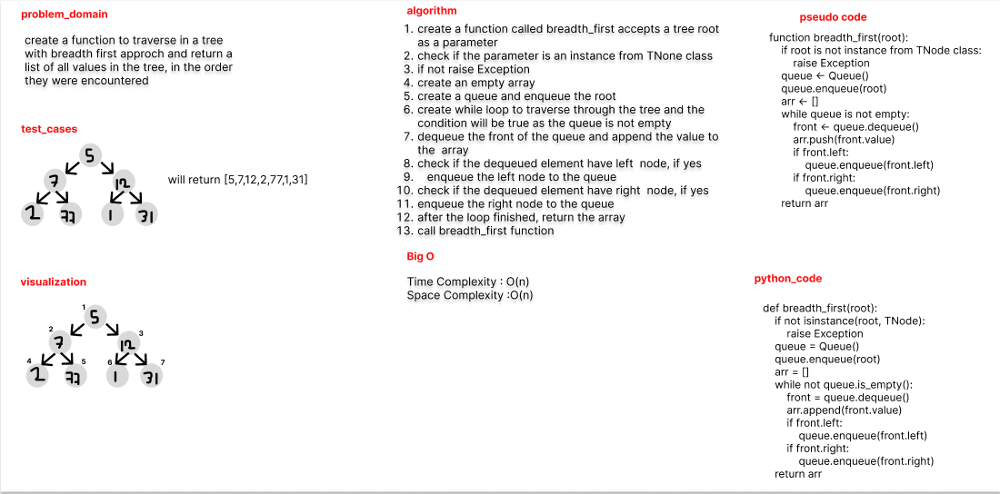

# Challenge Summary

create a function to traverse in a tree with breadth first approach and return a
list of all values in the tree, in the order they were encountered

## Whiteboard Process



## Approach & Efficiency

use a queue to keep track of the nodes to be visited

## Solution

```python
def breadth_first(root):
    if not isinstance(root, TNode):
        raise Exception
    queue = Queue()
    queue.enqueue(root)
    arr = []
    while not queue.is_empty():
        front = queue.dequeue()
        arr.append(front.value)
        if front.left:
            queue.enqueue(front.left)
        if front.right:
            queue.enqueue(front.right)
    return arr
```