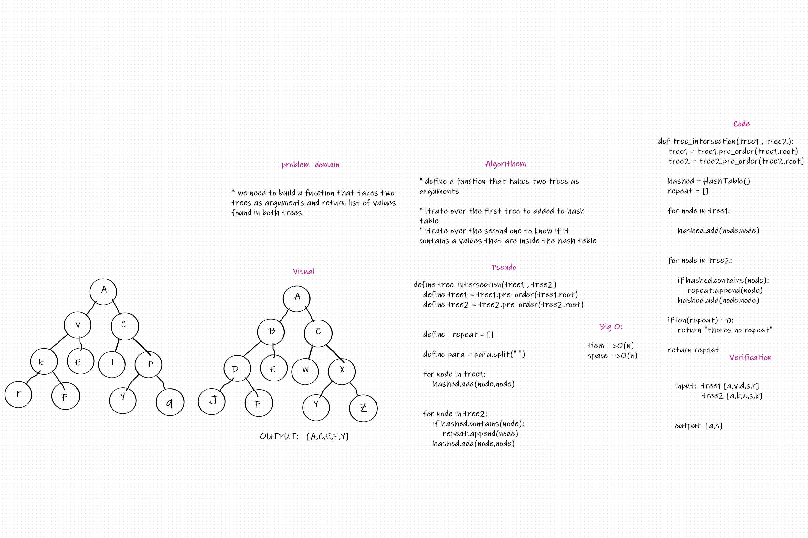

# Challenge Summary
Write a function called tree_intersection that takes two binary trees as parameters.


## Whiteboard Process


## Approach & Efficiency
Using your Hashmap implementation as a part of the algorithm, return a set of values found in both trees.

## Solution
```python
def tree_intersection(tree1, tree2):
    tree1 = tree1.pre_order()
    tree2 = tree2.pre_order()

    hashed = HashTable()
    repeat = []

    for node in tree1:
        hashed.set(node, node)

    for node in tree2:

        if hashed.contains(node):
            repeat.append(node)
        hashed.set(node, node)

    if len(repeat) == 0:
        return "theres no repeat"

    return repeat

```