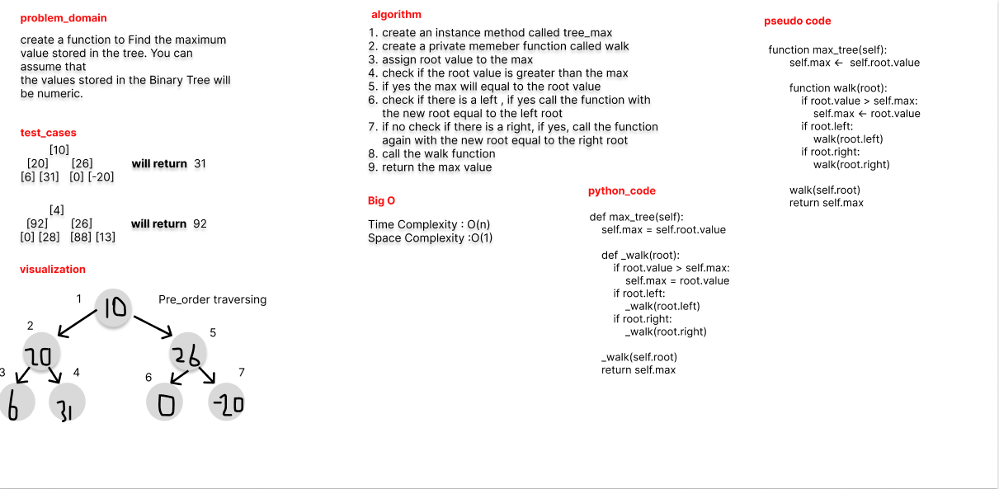

# Challenge Summary

Find the maximum value stored in the tree. You can assume that
the values stored in the Binary Tree will be numeric.

## Whiteboard Process

## Approach & Efficiency

using recursion approach to traverse over the whole tree

## Solution

```python
 def max_tree(self):
    self.max = self.root.value

    def _walk(root):
        if root.value > self.max:
            self.max = root.value
        if root.left:
            _walk(root.left)
        if root.right:
            _walk(root.right)

    _walk(self.root)
    return self.max
```