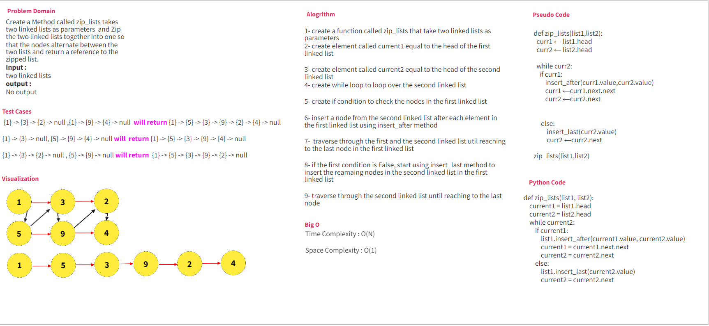

## Challenge

Write Function Called zip_lists takes two linked lists and  Zip the two linked lists together into one so 
that the nodes alternate between the two lists and return a reference to  the zipped list.

## Whiteboard Process

 

## Approach & Efficiency  

Create Function Called zip_lists take two linked lists, this function will have while loop to traverse over the second list
and until reach to the end of it, and at the same time inject the elements from the second list inside the first 
lists 

## Solution 
Inside the file called zip_lists.py, two lists are created,
one is the first list and the other is the second list.
both lists are created with the help of the linked list class and 
passed as arguments to the function zip_lists.
when running file as the main file the zip_lists function will be called,
after that to_string function will be called to show the new changes in linked list1

